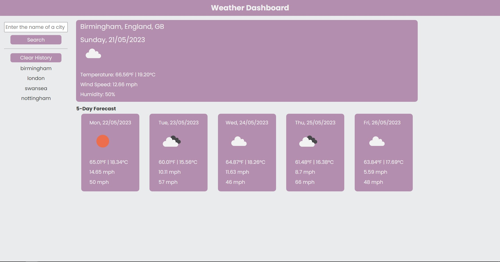

# week-6-weather-dashboard

## Purpose of Task

Use of the 5 Day Weather Forecast API to create a weather dashboard. The user will be able to search for a city and will then be presented with the current weather and a forecast for the next five days. The user's search history will be saved into local storage. The page will make use of HTML, CSS and JavaScript and will be responsive in its design.

## User Story

```
AS A traveler
I WANT to see the weather outlook for multiple cities
SO THAT I can plan a trip accordingly
```

## Acceptance Criteria

```
GIVEN a weather dashboard with form inputs
WHEN I search for a city
THEN I am presented with current and future conditions for that city and that city is added to the search history
WHEN I view current weather conditions for that city
THEN I am presented with the city name, the date, an icon representation of weather conditions, the temperature, the humidity, and the wind speed
WHEN I view future weather conditions for that city
THEN I am presented with a 5-day forecast that displays the date, an icon representation of weather conditions, the temperature, the wind speed, and the humidity
WHEN I click on a city in the search history
THEN I am again presented with current and future conditions for that city
```

## Problems Solved

- When the user searches for a city, the current weather and the 5 day forecast sections are populated with weather data for that city, and the city name is added to the user's search history using local storage
    - If the user searches for the same city multiple times, there will still only be one entry for that city in their search history
- The current weather section shows the city, state and country names, the current day and date, an icon of current weather conditions, the temperature in both Fahrenheit and Celsius, the wind speed in mph and the humidity as a percentage.
- The forecast section shows the same information as the current weather section, save for the city, state and country names, for the next 5 days
- Clicking on a city in the user's search history will perform a search for that city's weather information
    - The user can clear their search history by clicking the clear history button, this only appears after at least once search has been made

## Screenshot

 

## Deployed Webpage

The published page is available here: